# SolarEdge Inverters - SunSpec Logging

> Technical Note, version 3.2 - June 2025
> Copyright SolarEdge Technologies, Ltd 2024. All rights reserved.

> Converted from the June 2025 PDF. Page headers, footers, and decorative elements were omitted; technical figures and tables were retained.

## Table of contents

- [Revision History](#revision-history)
- [About](#about)
- [Overview](#overview)
- [Communication Technologies](#communication-technologies)
  - [SunSpec](#sunspec)
  - [Modbus](#modbus)
- [SunSpec Supported Inverters](#sunspec-supported-inverters)
- [Use Cases for MODBUS over RS485](#use-cases-for-modbus-over-rs485)
  - [Physical Connection](#physical-connection)
  - [Single Inverter Connection](#single-inverter-connection)
  - [Multiple Inverter Connection](#multiple-inverter-connection)
    - [Connect to a non-SolarEdge monitoring device only (without connection to the monitoring platform)](#connect-to-a-non-solaredge-monitoring-device-only-without-connection-to-the-monitoring-platform)
    - [Connection to a non-SolarEdge monitoring device (with connection to the monitoring platform)](#connection-to-a-non-solaredge-monitoring-device-with-connection-to-the-monitoring-platform)
    - [Connection to the monitoring platform and to a non-SolarEdge monitoring device using a Commercial Gateway](#connection-to-the-monitoring-platform-and-to-a-non-solaredge-monitoring-device-using-a-commercial-gateway)
- [Use Cases for MODBUS over TCP](#use-cases-for-modbus-over-tcp)
  - [Single Inverter Connection](#single-inverter-connection-1)
  - [Multiple Inverter Connection](#multiple-inverter-connection-1)
    - [Connection to a non-SolarEdge monitoring device only (without connection to the SolarEdge monitoring platform)](#connection-to-a-non-solaredge-monitoring-device-only-without-connection-to-the-solaredge-monitoring-platform)
    - [Connection to a non-SolarEdge monitoring device (with connection to the SolarEdge monitoring platform)](#connection-to-a-non-solaredge-monitoring-device-with-connection-to-the-solaredge-monitoring-platform)
  - [Connection to the SolarEdge monitoring platform and to a non-SolarEdge monitoring device using a Commercial Gateway](#connection-to-the-solaredge-monitoring-platform-and-to-a-non-solaredge-monitoring-device-using-a-commercial-gateway)
- [SolarEdge Device Configuration - Using SetApp](#solaredge-device-configuration-using-setapp)
  - [Modbus over RS485 Configuration](#modbus-over-rs485-configuration)
  - [MODBUS over TCP Support](#modbus-over-tcp-support)
  - [MODBUS over TCP Configuration](#modbus-over-tcp-configuration)
- [SolarEdge Device Configuration - Using the Inverter/Commercial Gateway Display (LCD)](#solaredge-device-configuration-using-the-invertercommercial-gateway-display-lcd)
  - [Modbus over RS485 Configuration](#modbus-over-rs485-configuration-1)
  - [MODBUS over TCP Support](#modbus-over-tcp-support-1)
  - [MODBUS over TCP Configuration](#modbus-over-tcp-configuration-1)
- [Register Mapping - Monitoring Data](#register-mapping-monitoring-data)
  - [Common Model MODBUS Register Mappings-replacement](#common-model-modbus-register-mappings-replacement)
    - [Meter layout](#meter-layout)
  - [Inverter Device Status Values](#inverter-device-status-values)
  - [Inverter Model MODBUS Register Mappings](#inverter-model-modbus-register-mappings)
- [Multiple MPPT Inverter Extension Model](#multiple-mppt-inverter-extension-model)
- [Meter Models](#meter-models)
  - [Meter Device Block](#meter-device-block)
    - [Energy Value](#energy-value)
  - [Meter Event Flag Values](#meter-event-flag-values)
  - [MODBUS Register Mappings](#modbus-register-mappings)
    - [Meter Model - MODBUS Mapping](#meter-model-modbus-mapping)
    - [Meter 1](#meter-1)
    - [Meter 2](#meter-2)
    - [Meter 3](#meter-3)
- [Appendix A - Encoding and Decoding Examples](#appendix-a-encoding-and-decoding-examples)
  - [Client Request/Server Response Register Structure](#client-requestserver-response-register-structure)
  - [Read Single or Multiple Register Data](#read-single-or-multiple-register-data)
    - [Client Request Register](#client-request-register)
    - [Server Response Register](#server-response-register)
  - [Abnormal Response Data](#abnormal-response-data)
- [Appendix B - Response Time Information](#appendix-b-response-time-information)
  - [Timing Definitions](#timing-definitions)
  - [Modbus External Interface](#modbus-external-interface)
    - [Indirect (Daisy-Chain)](#indirect-daisy-chain)
    - [Direct/Single Inverter Connection](#directsingle-inverter-connection)
  - [SolarEdge timing performance](#solaredge-timing-performance)
- [Support Contact Information](#support-contact-information)

## Revision History

| Version | Date | Description |
| --- | --- | --- |
| 3.2 | June 2025 | Added supported MODBUS register values 40119 and 40120 |
| 3.1 | June 2025 | Updated section: Modbus over TCP Support |
| 3.0 | March 2025 | Added various updates |
| 2.7 | May 2024 | Updated Appendix A and Appendix B. Removed Appendix C. |
| 2.6 | December 2023 | Updated L-L voltage for SE meter via MODBUS |

## About

This Technical Note describes the configuration of SunSpec supported inverters.

## Overview

SolarEdge inverters support transmission of inverter-level monitoring data directly from the inverter to a local non-SolarEdge device using the SunSpec open protocol for interoperability between devices in renewable energy systems. This option can be used alongside the connection to the SolarEdge monitoring server. This document describes the connection method, and the protocol and configurations needed to implement this feature.

Direct connection to a monitoring device is useful when a network connection is unavailable, when extensive custom data processing is required, or when authorities require direct access to monitoring data.

In many cases, it is possible - and recommended - to employ the direct connection alongside a SolarEdge monitoring platform connection. Connection to the monitoring platform enables all the monitoring benefits, primarily:

- Proactive installer maintenance and real time troubleshooting by SolarEdge support, using with the physical mapping available only in the monitoring platform

- Module-level monitoring

## Communication Technologies

SolarEdge uses an open, industry-standard communications stack to provide efficient messaging between SolarEdge and third-party devices and applications.

The communications stack components are briefly described below.

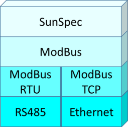

### SunSpec

SunSpec is an application-layer communications protocol designed to achieve interoperability between Distributed Energy Resource (DER) components and smart grid applications.

### Modbus

Modbus is a serial communications protocol typically used to connect data collection terminals to a centralized processing unit. SolarEdge products use Modbus to perform SunSpec messaging over two types of physical/link-layer channels:

- Modbus RTU: Remote Terminal Unit (RTU) Modbus over a serial RS485 connection

- Modbus TCP: Modbus over an Ethernet connection

SolarEdge systems support a single Modbus Leader only - either single Modbus RTU or single Modbus TCP.

## SunSpec Supported Inverters

Depending on their type, SolarEdge devices may be configured in either of the two ways:

- Using SetApp

- Using the LCD

All SolarEdge inverters with SetApp configuration are SunSpec-supported.

SolarEdge inverters with the LCD that have Firmware version 3.xxxx and above only are SunSpec-supported.

To check the inverter firmware versions (for inverters with the LCD):

1. Short press the LCD light button until the following screen is displayed:

2. If required, upgrade to the latest available firmware as described in [Upgrading an Inverter Using a Micro SD Card](https://knowledge-center.solaredge.com/sites/kc/files/upgrading_an_inverter_using_micro_sd_card.pdf).

## Use Cases for MODBUS over RS485

This section describes RS485 options to connect the inverter to a non-SolarEdge monitoring device.

### Physical Connection

The connection is performed using an RS485 connector with a twisted pair cable. The transmission mode in SolarEdge inverters is set to RTU (binary).

The COM port default properties are: 115200 bps, 8 data bits, no parity, 1 stop bit, no flow control. Baud rate can be changed between 9600bps to 115200bps (supported from CPU version 2.0549).

The RS485 bus can be configured to support connection either to a non-SolarEdge monitoring device or Leader-Follower connection between SolarEdge inverters. Therefore, a Follower inverter cannot communicate simultaneously with a Leader inverter and with a non-SolarEdge monitoring device on the same RS485 bus.

All SolarEdge inverters with SetApp configuration have two built-in RS485 ports. An inverter can act as Leader on both ports simultaneously. Each port on a leader inverter can connect to up to 31 follower inverters. The two ports therefore support connectivity with 62 follower inverters.

A Commercial Gateway with LCD can act as Leader on one of the built-in RS485 ports and on the RS485 Plug-in.

For more information, see the [RS485 Expansion Kit Installation Guide](https://knowledge-center.solaredge.com/sites/kc/files/RS485_expansion_kit_installation_guide.pdf).

#### Note

For connectivity purposes, the Synergy Manager is considered a single inverter.

### Single Inverter Connection

Use the RS485 bus for connecting to a non-SolarEdge monitoring device.

Use the Ethernet connection or any of the optional wireless connection options to connect to the SolarEdge monitoring platform.

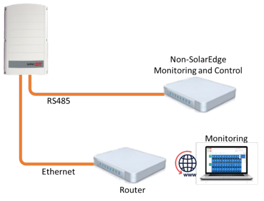

### Multiple Inverter Connection

#### Connect to a non-SolarEdge monitoring device only (without connection to the monitoring platform)

Use RS485-2 or RS485-E to connect the leader to a non-SolarEdge monitoring device. Every inverter in the RS485 bus should be configured to a different device ID (MODBUS ID).

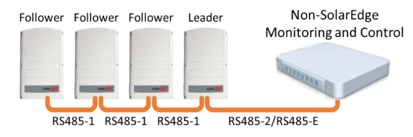

#### Connection to a non-SolarEdge monitoring device (with connection to the monitoring platform)

Use the RS485 bus for connection to a non-SolarEdge monitoring device. Every inverter in the RS485 bus should be configured to a different device ID (MODBUS ID).

Option 1 (direct connection) - Connect each inverter to the router via Ethernet cables.

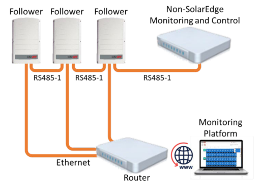

Option 2 - Connect the router to one inverter only.

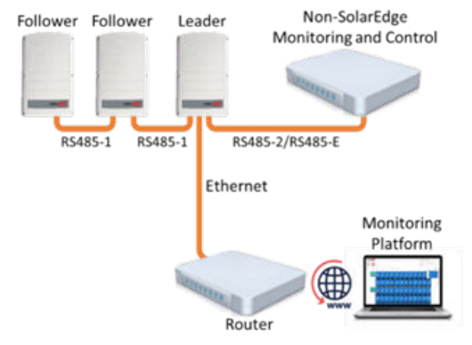

#### Connection to the monitoring platform and to a non-SolarEdge monitoring device using a Commercial Gateway

Use the RS485-2 bus for connection to a non-SolarEdge monitoring device. Every inverter connected to the RS485 bus should be configured to a different device ID (MODBUS ID).

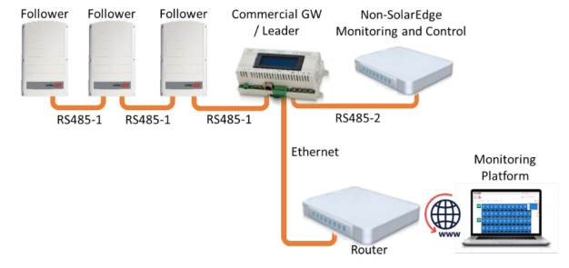

If required, use the RS485-E bus for connecting a second chain of inverters.

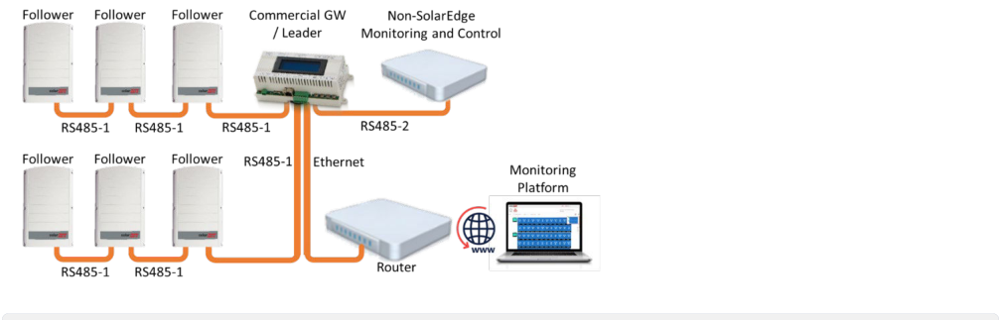

## Use Cases for MODBUS over TCP

This section describes MODBUS over TCP options to connect the inverter to a non-SolarEdge monitoring device.

### Single Inverter Connection

Use Ethernet for connecting to a non-SolarEdge monitoring device.

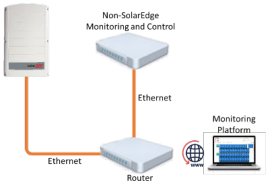

### Multiple Inverter Connection

#### Connection to a non-SolarEdge monitoring device only (without connection to the SolarEdge monitoring platform)

Use Ethernet for connection to a non-SolarEdge monitoring device.

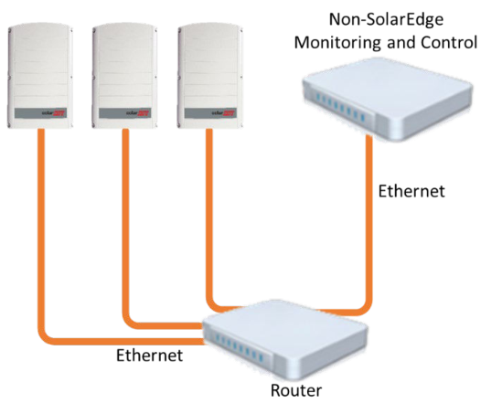

#### Connection to a non-SolarEdge monitoring device (with connection to the SolarEdge monitoring platform)

Use Ethernet for connection to a non-SolarEdge monitoring device.

Option 1 (direct connection) - Connect each inverter to the Ethernet router via Ethernet cables.

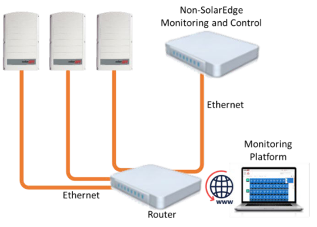

Option 2 - Connect the Leader only to the Ethernet router via Ethernet cables.

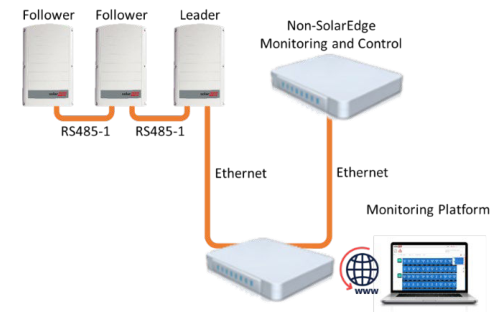

Connect a second chain of the inverters to the Leader inverter using RS485-2/RS485-E.

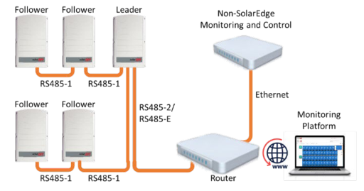

### Connection to the SolarEdge monitoring platform and to a non-SolarEdge monitoring device using a Commercial Gateway

Use Ethernet for connection to a non-SolarEdge monitoring device. Every inverter connected to the RS485 bus should be configured to a different device ID (MODBUS ID).

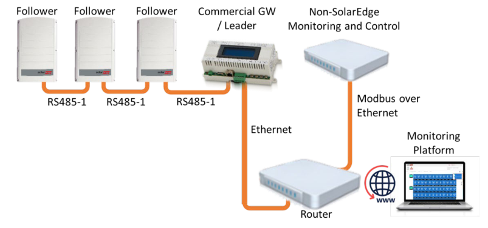

If required, use the RS485-E bus for connecting a second chain of inverters.

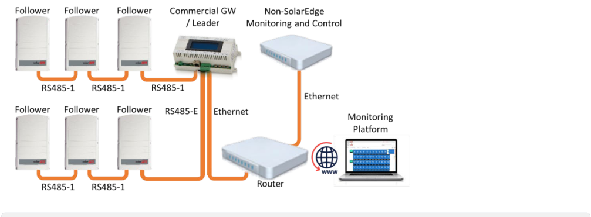

## SolarEdge Device Configuration - Using SetApp

This section describes how to configure a SolarEdge device (inverter or Commercial Gateway) to be monitored by a non-SolarEdge monitoring device using SetApp.

#### Note

The actual SetApp configuration procedures may differ from the ones shown in this document.

#### Note

Use CCG as a leader only when extending communication for RS485. In all other cases, configure it as a follower.

To reach the main setup menu, go to SetApp and tap Commissioning > Site Communication

### Modbus over RS485 Configuration

To configure the inverters (when used without the Commercial Gateway):

#### Note

Use CCG as a leader only when extending communication for RS485. In all other cases, configure it as a follower.

1. Under the Site Communication menu, set the following:

  - RS485-1 > Protocol > SunSpec (Non-SE Logger)

- RS485-1 > Device ID, and enter the MODBUS address (a unique value 1…247). This will set the register C_DeviceAddress.

2. If needed, set the baud rate to a preferred value: RS485-1 > Baud rate and enter the rate.

To configure the inverters and gateway (when used with the Commercial Gateway):

1. Inverter configuration: For all inverters, verify the following RS485 bus settings under the Site Communication menu:

  - RS485-1 > Protocol > SolarEdge > SolarEdge Follower

  - RS485-1 > Device ID > [a unique value 1…247]

2. Commercial Gateway configuration using the device display: Use RS485-1 to connect to the inverters. RS485-1 bus configuration is as follows:

  - Communication > RS485-1 Conf > Device Type > SolarEdge

  - Communication > RS485-1 Conf > Protocol > Leader

  - Communication > RS485-1 Conf > Follower Detect

The Commercial Gateway should report the correct number of Follower inverters. If it does not, verify the connections and terminations.

3. Use RS485-2 to connect the Commercial Gateway to the non-SolarEdge monitoring device. Configure the RS485-2 bus settings as follows, using the device display:

  - Communication > RS485-2 Conf > Protocol > SunSpec (Non-SE Logger)

The Commercial Gateway device ID is irrelevant for communications, but needs to be set to a different ID than the one set for the inverters.

  - Communication > RS485-2 Conf > Device ID  [use one of the higher IDs (e.g. 247) to make sure it is out of scope]

  - The default baud rate is 115200 bps. If a different baud rate is required, select: Communication > RS485-2 Conf > Baud Rate

4. Make sure the device ID of the non-SolarEdge monitoring device is different from all other device IDs configured in the inverters and gateways.

5. Connect the Commercial Gateway to router via the Ethernet interface and configure the following settings using the device display:

  - Communication > Server > LAN

  - Communication > LAN Conf > Set DHCP > [Select Enable for DHCP or Disable for static IP configuration]

  - For Static DHCP setting, configure as follows:

  - Communication > LAN Conf > Set IP > [Set inverters’ IP]

  - Communication > LAN Conf > Set Mask > [Set inverters’ subnet mask]

  - Communication > LAN Conf > Set Gateway > [Set inverters’ gateway]

  - Communication > LAN Conf > Set DNS > [Set inverters’ DNS]

6. If the router is connected to the server, select Commissioning > Status and verify that “S_OK” is displayed on the Status page.

### MODBUS over TCP Support

MODBUS/TCP uses the Ethernet media in physical layers to carry the MODBUS message handling structure and can support a large number of devices in one network; it is easier to integrate into the Local Area Network (LAN) of a company, so it is the choice of more and more customers.

Here, it is used for remote third-party monitoring and control. MODBUS TCP is agnostic of the server connection. It works only over LAN. When configured, MODBUS TCP does not initiate a connection - the server waits for a client to connect. Only a single connection and session are supported.

#### Note

The MODBUS TCP function is disabled by default. When enabled, it supports TCP port 1502 by default. Port number can be reconfigured.

### MODBUS over TCP Configuration

To set up MODBUS TCP:

1. Select Site Communication > Modbus TCP > Enable. A new Port menu is added to the screen (the default port is 1502).

2. To modify the TCP port, select Port, set the port number and tap Done.

#### Note

The default device ID of the inverter connected to Ethernet is 1.

#### Note

The TCP server idle time is 2 minutes. In order to leave the connection open, the request should be made within 2 minutes. The connection can remain open without any MODBUS requests.

## SolarEdge Device Configuration - Using the Inverter/Commercial Gateway Display (LCD)

This section describes how to configure a SolarEdge device (inverter or Commercial Gateway) to be monitored by a non-SolarEdge monitoring device using the LCD. To reach the main setup menu, follow the instructions in the Installation Guide of the specific SolarEdge device.

### Modbus over RS485 Configuration

To configure the inverters (when used without the Commercial Gateway):

1. In the Communication menu, set the following:

   a. Communication > Server > select any server connection except RS485. If the inverter is not connected to the SolarEdge monitoring platform, select None.

   b. Communication > RS485-1 Conf

c. RS485-1 Conf > Device Type > Non-SE Logger

d. RS485-1 Conf > Protocol > SunSpec

e. RS485-1 Conf > Device ID, and enter the MODBUS address (a unique value 1…247). This sets the `C_DeviceAddress` register.

2. If necessary, set the baud rate to a preferred value: RS485-1 Conf > Baud rate and enter the rate.

To configure the inverter (when used with the Commercial Gateway):

1. Inverters configuration: For all inverters, set the following RS485 bus settings:

  - Communication > RS485-1 Conf > Device Type > SolarEdge

  - Communication > RS485-1 Conf > Protocol > Follower

  - Communication > RS485-1 Conf > Device ID > [a unique value 1…247]

2. Commercial Gateway configuration: Use RS485-1 to connect to the inverters. RS485-1 bus configuration is as follows:

  - Communication > RS485-1 Conf > Device Type > SolarEdge

  - Communication > RS485-1 Conf > Protocol > Master

  - Communication > RS485-1 Conf > Follower Detect

The Commercial Gateway should report the correct number of followers. If it does not, verify the connections and terminations.

Use RS485-2 to connect to the non-SolarEdge monitoring device. RS485-2 bus configuration is as follows:

  - Communication > RS485-2 Conf > Device Type > Non-SE Logger

  - Communication > RS485-2 Conf > Protocol > SunSpec

The Commercial Gateway Device ID is irrelevant for communications, but needs to be set to a different ID than the one set for the inverters.

  - Communication > RS485-2 Conf > Device ID > [use one of the higher ID’s (e.g. 247) to make sure it is out of scope]

  - The default baud rate is 115200 bps. If a different baud rate is required, select: Communication > RS485-2 Conf > Baud Rate

3. Make sure the device ID of the non-SolarEdge monitoring device is different from all other device IDs configured in the inverters and gateways.

4. Connect the Commercial Gateway to router via the Ethernet interface and configure the following settings:

  - Communication > Server > LAN

  - Communication > LAN Conf > Set DHCP > [Select Enable for DHCP or Disable for static IP configuration]

  - For Static DHCP setting, configure as follows:

  - Communication > LAN Conf > Set IP > [Set inverters’ IP]

  - Communication > LAN Conf > Set Mask > [Set inverters’ subnet mask]

  - Communication > LAN Conf > Set Gateway > [Set inverters’ gateway]

  - Communication > LAN Conf > Set DNS > [Set inverters’ DNS]

5. If the router is connected to the server, verify that the LCD panel displays <S_OK>.

6. Verify that the LCD panel of all inverters is <S_OK>.

### MODBUS over TCP Support

MODBUS/TCP uses the Ethernet media in physical layers to carry the MODBUS message handling structure and can support a large number of devices in one network; it is easier to integrate into the Local Area Network (LAN) of a company, so it is the choice of more and more customers.

Here, it is used for remote third-party monitoring and control. MODBUS TCP is agnostic of the server connection. It works only over LAN. When configured, MODBUS TCP does not initiate a connection. The server waits for a client to connect. Only one connection is supported.

#### Note

The MODBUS TCP function is disabled by default. When enabled, it supports TCP port 502 by default. The port number can be reconfigured.

### MODBUS over TCP Configuration

To set up MODBUS TCP:

1. Select Communication > LAN Conf > Modbus TCP (the default port is 502).

2. To modify the TCP port, select Modbus TCP > TCP Port, set the port number and long-press Enter.

#### Note

The default device ID of the inverter connected to the Ethernet is 1.

When the MODBUS TCP feature is enabled, the following information is displayed:

- Status:
  - Init - Initializing server. This state only occurs after the first configuration until it reaches the Ready status. This activity lasts about 10 seconds.
  - Ready - The server is up and waiting for a client to connect.
  - Connected - The client is connected.
  - Failed - The server is unable to accept clients (see error message).
- Error messages:
  - Disconnected - The Ethernet cable is not connected.
  - Gateway Ping Failed - A ping to the 1st router failed.
  - No IP - Either there is no DHCP or static IP configuration, no DHCP server assigned an IP address, or a static IP must be defined.

#### Note

The TCP server idle time is two minutes. In order to leave the connection open, the request should be made within 2 minutes. The connection can remain open without any MODBUS requests.

## Register Mapping - Monitoring Data

This section describes the registers mapping for the inverter monitoring data (read-only MODBUS protocol data). The SolarEdge inverter mapping for monitoring data is based on the open protocol managed by SunSpec: SunSpec Alliance Interoperability Specification - Inverter Models v1.0. Refer to the SunSpec Alliance Interoperability Specification - Common Models (Elements) document for a detailed description of the protocol.

The register mapping can be downloaded from the [SunSpec Alliance](http://www.sunspec.org/).

SolarEdge inverters support the following mappings:

- SunSpec module ID 101, 102 and 103 register mappings.

- SolarEdge three phase inverters with Synergy technology also support SunSpec module ID 160 register mappings.

### Common Model MODBUS Register Mappings-replacement

The base Register Common Block is set to 40001 (MODBUS PLC address [base 1]) or 40000 (MODBUS Protocol Address [base 0]).

All parameters are defined as in the SunSpec Common block definition, except for the C_Options register, which is set to NOT_IMPLEMENTED.

- C_Manufacturer is set to SolarEdge.

- C_Model is set to the appropriate inverter model, e.g. SE5000.

- C_Version contains the CPU software version with leading zeroes, e.g. 0002.0611.

- C_SerialNumber contains the inverter serial number.

- C_DeviceAddress is the device MODBUS ID.

#### Meter layout

| Address (base 0) | Address (base 1) | Size | Name | Type | Description |
| --- | --- | --- | --- | --- | --- |
| 40000 | 40001 | 2 | C_SunSpec_ID | uint32 | Value = "SunS" (0x53756e53). Uniquely identifies this as a SunSpec MODBUS Map |
| 40002 | 40003 | 1 | C_SunSpec_DID | uint16 | Value = 0x0001. Uniquely identifies this as a SunSpec Common Model Block |
| 40003 | 40004 | 1 | C_SunSpec_Length | uint16 | 65 = Length of block in 16-bit registers |
| 40004 | 40005 | 16 | C_Manufacturer | String(32) | Value Registered with SunSpec = "SolarEdge " |
| 40020 | 40021 | 16 | C_Model | String(32) | SolarEdge Specific Value |
| 40044 | 40045 | 8 | C_Version | String(16) | SolarEdge Specific Value |
| 40052 | 40053 | 16 | C_SerialNumber | String(32) | SolarEdge Unique Value |
| 40068 | 40069 | 1 | C_DeviceAddress | uint16 | MODBUS Unit ID |

### Inverter Device Status Values

The following `I_Status_*` values are supported:

| Parameter | Value | Description |
| --- | --- | --- |
| I_STATUS_OFF | 1 | Off |
| I_STATUS_SLEEPING | 2 | Sleeping (auto-shutdown) - Night mode |
| I_STATUS_STARTING | 3 | Grid Monitoring/wake-up |
| I_STATUS_MPPT | 4 | Inverter is ON and producing power |
| I_STATUS_THROTTLED | 5 | Production (curtailed) |
| I_STATUS_SHUTTING_DOWN | 6 | Shutting down |
| I_STATUS_FAULT | 7 | Fault |
| I_STATUS_STANDBY | 8 | Maintenance/setup |

1 Supported only in split-phase configurations (Japanese grid and 240V grid in North America)

### Inverter Model MODBUS Register Mappings

The following table lists the supported MODBUS register values. Unsupported values are indicated by the NOT_IMPLEMENTED value. The base register of the Device Specific block is set to 40070 (MODBUS PLC address [base 1]), or 40069 (MODBUS Protocol Address [base 0]).

- acc32 is a uint32 accumulator that should always increase. Its value is in the range of 0...4294967295.

- Scale Factors. As an alternative to floating point format, values are represented by Integer values with a signed scale factor applied. The scale factor explicitly shifts the decimal point to left (negative value) or to the right (positive value).

For example, a value “Value” may have an associated value “Value_SF” Value = “Value” * 10^ Value_SF for example:

- For “Value” = 2071 and “Value_SF” = -2 Value = 2071*10^-2 = 20.71

- For “Value” = 2071 and “Value_SF” = 2 Value = 2071*10^2 = 207100

| Address (base 0) | Address (base 1) | Size | Name | Type | Units | Description |
| --- | --- | --- | --- | --- | --- | --- |
| 40069 | 40070 | 1 | C_SunSpec_DID | uint16 |  | 101 = single phase 102 = split phase 103 = three phase |
| 40070 | 40071 | 1 | C_SunSpec_Length | uint16 | Registers | 50 = Length of model block |
| 40071 | 40072 | 1 | I_AC_Current | uint16 | Amps | AC Total Current value |
| 40072 | 40073 | 1 | I_AC_CurrentA | uint16 | Amps | AC Phase A Current value |
| 40073 | 40074 | 1 | I_AC_CurrentB | uint16 | Amps | AC Phase B Current value |
| 40074 | 40075 | 1 | I_AC_CurrentC | uint16 | Amps | AC Phase C Current value |
| 40075 | 40076 | 1 | I_AC_Current_SF | int16 |  | AC Current scale factor |
| 40076 | 40077 | 1 | I_AC_VoltageAB | uint16 | Volts | AC Voltage Phase AB value |
| 40077 | 40078 | 1 | I_AC_VoltageBC | uint16 | Volts | AC Voltage Phase BC value |
| 40078 | 40079 | 1 | I_AC_VoltageCA | uint16 | Volts | AC Voltage Phase CA value |
| 40079 | 40080 | 1 | I_AC_VoltageAN1 | uint16 | Volts | AC Voltage Phase A to N value |
| 40080 | 40081 | 1 | I_AC_VoltageBN1 | uint16 | Volts | AC Voltage Phase B to N value |
| 40081 | 40082 | 1 | I_AC_VoltageCN1 | uint16 | Volts | AC Voltage Phase C to N value |
| 40082 | 40083 | 1 | I_AC_Voltage_SF | int16 |  | AC Voltage scale factor |
| 40083 | 40084 | 1 | I_AC_Power | int16 | Watts | AC Power value |
| 40084 | 40085 | 1 | I_AC_Power_SF | int16 |  | AC Power scale factor |
| 40085 | 40086 | 1 | I_AC_Frequency | uint16 | Hertz | AC Frequency value |
| 40086 | 40087 | 1 | I_AC_Frequency_SF | int16 |  | Scale factor |
| 40087 | 40088 | 1 | I_AC_VA | int16 | VA | Apparent Power |
| 40088 | 40089 | 1 | I_AC_VA_SF | int16 |  | Scale factor |
| 40089 | 40090 | 1 | I_AC_VAR2 | int16 | VAR | Reactive Power |
| 40090 | 40091 | 1 | I_AC_VAR_SF2 | int16 |  | Scale factor |

1 Supported only in split-phase configurations (Japanese grid and 240V grid in North America).

2 For details, see the Power Configurations and Correlated Outcomes under Reactive Power [Configuration in SolarEdge Inverters, Power Control Options.](https://knowledge-center.solaredge.com/sites/kc/files/application_note_power_control_configuration.pdf)

| Address (base 0) | Address (base 1) | Size | Name | Type | Units | Description |
| --- | --- | --- | --- | --- | --- | --- |
| 40091 | 40092 | 1 | I_AC_PF1 | int16 | % | Power Factor |
| 40092 | 40093 | 1 | I_AC_PF_SF1 | int16 |  | Scale factor |
| 40093 | 40094 | 2 | I_AC_Energy_WH | acc32 | WattHours | AC Lifetime Energy production |
| 40095 | 40096 | 1 | I_AC_Energy_WH_SF | uint16 |  | Scale factor |
| 40096 | 40097 | 1 | I_DC_Current | uint16 | Amps | DC Current value |
| 40097 | 40098 | 1 | I_DC_Current_SF | int16 |  | Scale factor |
| 40098 | 40099 | 1 | I_DC_Voltage | uint16 | Volts | DC Voltage value |
| 40099 | 40100 | 1 | I_DC_Voltage_SF | int16 |  | Scale factor |
| 40100 | 40101 | 1 | I_DC_Power | int16 | Watts | DC Power value |
| 40101 | 40102 | 1 | I_DC_Power_SF | int16 |  | Scale factor |
| 40103 | 40104 | 1 | I_Temp_Sink | int16 | Degrees C | Heat Sink Temperature |
| 40106 | 40107 | 1 | I_Temp_SF | int16 |  | Scale factor |
| 40107 | 40108 | 1 | I_Status | uint16 |  | Operating State |
| 40108a | 40109 | 1 | I_Status_Vendor | uint16 |  | Vendor-defined operating state and error codes. For error description, meaning, and troubleshooting, refer to the SolarEdge Installation Guide. |
| 40119 | 40120 | 2 | I_Status_Vendor4 | uint32 |  | Vendor-defined operating state and error codes. For error description, meaning, and troubleshooting, refer to the SolarEdge Installation Guide, 16MSB for controller type (3x, 8x, 18x) and 16 LSB for error code. |

a Use this field for versions up to 3.19.XX

For details, see the Power Configurations and Correlated Outcomes under Reactive Power [Configuration in SolarEdge Inverters, Power Control Options.](https://knowledge-center.solaredge.com/sites/kc/files/application_note_power_control_configuration.pdf)

## Multiple MPPT Inverter Extension Model

The Multiple MPPT (Maximum Power Point Tracker) Inverter Extension Model (160) is supported for SolarEdge Synergy Inverters with firmware version 4.13.xx or later. The fixed block data below refers to an entire Synergy Manager system (and not to individual blocks within the system).

| Address (base 0) | Address (base 1) | Name | Size | Type | Units | Description |
| --- | --- | --- | --- | --- | --- | --- |
| Header (Size: 2 words) |  |  |  |  |  |  |
| 40121 | 40122 | ID | 1 | uint16 | N/A | Value = 160 Multiple MPPT Inverter Extension Model |
| 40122 | 40123 | L | 1 | uint16 | N/A | Model length |
| Fixed Block (Size: 8 words) |  |  |  |  |  |  |
| 40123 | 40124 | DCA_SF | 1 | sunssf | N/A | Current Scale Factor |
| 40124 | 40125 | DCV_SF | 1 | sunssf |  | Voltage Scale Factor |
| 40125 | 40126 | DCW_SF | 1 | sunssf |  | Power Scale Factor |
| 40126 | 40127 | DCWH_SF | 1 | sunssf |  | 0 (not supported) |
| 40127 | 40128 | Evt | 2 | bitfield32 |  | 0 (not supported) |
| 40129 | 40130 | N | 1 | count |  | Number of Synergy units (2 or 3) |
| 40130 | 40131 | TmsPer | 1 | uint16 |  | 0 (not supported) |
| Synergy Unit 0 Block (Size: 20 words) |  |  |  |  |  |  |
| 40131 | 40132 | ID | 1 | uint16 |  | Synergy Unit #0 |
| 40132 | 40133 | IDStr | 8 | string |  | Input ID String |

| Address (base 0) | Address (base 1) | Name | Size | Type | Units | Description |
| --- | --- | --- | --- | --- | --- | --- |
| 40140 | 40141 | DCA | 1 | uint16 |  | DC Current (A) |
| 40141 | 40142 | DCV | 1 | uint16 |  | DC Voltage (V) |
| 40142 | 40143 | DCW | 1 | uint16 |  | DC Power (W) |
| 40143 | 40144 | DCWH | 2 | acc32 |  | 0 (not supported) |
| 40145 | 40146 | Tms | 2 | uint32 |  | 0 (not supported) |
| 40147 | 40148 | Tmp | 1 | int16 |  | Temperature (oC) |
| 40148 | 40149 | DCSt | 1 | enum16 |  | 0 (not supported) |
| 40149 | 40150 | DCEvt | 2 | bitfield32 |  | 0 (not supported) |
| Synergy Unit 1 Block (Size: 20 words) |  |  |  |  |  |  |
| 40151 | 40152 | ID | 1 | uint16 |  | Synergy Unit #1 |
| 40152 | 40153 | IDStr | 8 | string |  | Input ID String |
| 40160 | 40161 | DCA | 1 | uint16 |  | DC Current (A) |
| 40161 | 40162 | DCV | 1 | uint16 |  | DC Voltage (V) |
| 40162 | 40163 | DCW | 1 | uint16 |  | DC Power (W) |
| 40163 | 40164 | DCWH | 2 | acc32 |  | 0 (not supported) |
| 40165 | 40166 | Tms | 2 | uint32 |  | 0 (not supported) |
| 40167 | 40168 | Tmp | 1 | int16 |  | Temperature (oC) |
| 40168 | 40169 | DCSt | 1 | enum16 |  | 0 (not supported) |
| 40169 | 40170 | DCEvt | 2 | bitfield32 |  | 0 (not supported) |

| Address (base 0) | Address (base 1) | Name | Size | Type | Units | Description |
| --- | --- | --- | --- | --- | --- | --- |
| Synergy Unit 2 Block (Size: 20 words) |  |  |  |  |  |  |
| 40171 | 40172 | ID | 1 | uint16 |  | Synergy Unit #2 |
| 40172 | 40173 | IDStr | 8 | string |  | Input ID String |
| 40180 | 40181 | DCA | 1 | uint16 |  | DC Current (A) |
| 40181 | 40182 | DCV | 1 | uint16 |  | DC Voltage (V) |
| 40182 | 40183 | DCW | 1 | uint16 |  | DC Power (W) |
| 40183 | 40184 | DCWH | 2 | acc32 |  | 0 (not supported) |
| 40185 | 40186 | Tms | 2 | uint32 |  | 0 (not supported) |
| 40187 | 40188 | Tmp | 1 | int16 |  | Temperature (oC) |
| 40188 | 40189 | DCSt | 1 | enum16 |  | 0 (not supported) |
| 40189 | 40190 | DCEvt | 2 | bitfield32 |  | 0 (not supported) |

## Meter Models

The SunSpec Alliance Interoperability Specification describes the data models and MODBUS register mappings for meter devices used in Renewable Energy systems. This section defines the models for:

- Single Phase Meter

- Split Phase Meter

- WYE (4-wire) Meter

- Delta (3-wire)Meter

### Meter Device Block

The following data elements are provided to describe meters:

- C_SunSpec_DID - A well-known value that uniquely identifies this block as a meter block. (4) for single phase meters and (5) for three phase meter types.

- C_SunSpec_Length - The length of the meter block in registers.

- M_AC_xxxx - Meter AC values.

- M_Exported_xxxx - Meter Exported Energy values

- M_Imported_xxxx - Meter Imported Energy values

#### Energy Value

The energy value is represented by a 32-bit unsigned integer accumulator with a scale factor. Values for import and export are provided. Unsupported or invalid accumulators may return 0x00000000. Power signs and Energy quadrants are per IEEE 1459-2000.

### Meter Event Flag Values

The SunSpec Common Elements defines a C_Event value. The meter specific flags are defined here.

| C_Event Value | Flag | Description |
| --- | --- | --- |
| M_EVENT_Power_Failure | 0x00000004 | Loss of power or phase |
| M_EVENT_Under_Voltage | 0x00000008 | Voltage below threshold (Phase Loss) |
| M_EVENT_Low_PF | 0x00000010 | Power Factor below threshold (can indicate miss- associated voltage and current inputs in three phase systems) |
| M_EVENT_Over_Current | 0x00000020 | Current Input over threshold (out of measurement range) |
| M_EVENT_Over_Voltage | 0x00000040 | Voltage Input over threshold (out of measurement range) |
| M_EVENT_Missing_Sensor | 0x00000080 | Sensor not connected |
| M_EVENT_Reserved1 | 0x00000100 | Reserved for future use |
| M_EVENT_Reserved2 | 0x00000200 | Reserved for future use |
| M_EVENT_Reserved3 | 0x00000400 | Reserved for future use |
| M_EVENT_Reserved4 | 0x00000800 | Reserved for future use |
| M_EVENT_Reserved5 | 0x00001000 | Reserved for future use |
| M_EVENT_Reserved6 | 0x00002000 | Reserved for future use |
| M_EVENT_Reserved7 | 0x00004000 | Reserved for future use |
| M_EVENT_Reserved8 | 0x00008000 | Reserved for future use |
| M_EVENT_OEM1-15 | 0x7FFF000 | Reserved for OEMs |

### MODBUS Register Mappings

#### Meter Model - MODBUS Mapping

This map supports single, split, wye, and delta meter connections in a single map as proper subsets. The connection type is distinguished by the C_SunSpec_DID. Registers that are not applicable to a meter class return the unsupported value (for example, Single Phase meters will support only summary and phase A values).

#### Note

Modbus registers store data in Big-Endian format. Most-significant values are stored first, at the lowest storage address.

The meters’ base address is calculated as shown in the table below:

- For 2-unit three phase inverters with Synergy technology, add 50 to the default addresses.

- For 3-unit three phase inverters with Synergy technology, add 70 to the default addresses.

| Meter | Default (base 0) | Default (base 1) | 2-unit (base 0) | 2-unit (base 1) | 3-unit (base 0) | 3-unit (base 1) |
| --- | --- | --- | --- | --- | --- | --- |
| 1st meter | 40000 + 121 | 40000 + 122 | 40000 + 171 | 40000 + 172 | 40000 + 191 | 40000 + 192 |
| 2nd meter | 40000 + 295 | 40000 + 296 | 40000 + 345 | 40000 + 346 | 40000 + 365 | 40000 + 366 |
| 3rd meter | 40000 + 469 | 40000 + 470 | 40000 + 519 | 40000 + 520 | 40000 + 539 | 40000 + 540 |

#### Note

Only enabled meters are readable, i.e. if meter 1 and 3 are enabled, they are readable as 1st (and the 3rd meter isn't readable). The meter type can be read from the Common Block Options field (the same strings that we use in the menus).

#### Meter 1

##### Meter 1 parameters

| Address (base 0) | Address (base 1) | Size | Name | Type | Units | Description |
| --- | --- | --- | --- | --- | --- | --- |
| **Common Block** |  |  |  |  |  |  |
| 40121 | 40122 | 1 | C_SunSpec_DID | uint16 | N/A | Value = 0x0001. Uniquely identifies this as a SunSpec Common Model Block |
| 40122 | 40123 | 1 | C_SunSpec_Length | uint16 | N/A | 65 = Length of block in 16-bit registers |
| 40123 | 40124 | 16 | C_Manufacturer | String(32) | N/A | Meter manufacturer |
| 40139 | 40140 | 16 | C_Model | String(32) | N/A | Meter mode |
| 40155 | 40156 | 8 | C_Option | String(16) | N/A | Export + Import, Production, consumption, |
| 40163 | 40164 | 8 | C_Version | String(16) | N/A | Meter version |
| 40171 | 40172 | 16 | C_SerialNumber | String(32) | N/A | Meter SN |
| 40187 | 40188 | 1 | C_DeviceAddress | uint16 | N/A | Inverter Modbus ID |
| **Identification** |  |  |  |  |  |  |
| 40188 | 40189 | 1 | C_SunSpec_DID | uint16 | N/A | Well-known value. Uniquely identifies this as a SunSpec MODBUS Map: Single Phase (AN or AB) Meter (201) Split Single Phase (ABN) Meter (202) Wye-Connect Three Phase (ABCN) Meter (203) Delta-Connect Three Phase (ABC) Meter(204) |
| 40189 | 40190 | 1 | C_SunSpec_Length | uint16 | Registers | Length of meter model block |
| **Current** |  |  |  |  |  |  |
| 40190 | 40191 | 1 | M_AC_Current | int16 | Amps | AC Current (sum of active phases) |
| 40191 | 40192 | 1 | M_AC_Current_A | int16 | Amps | Phase A AC Current |
| 40192 | 40193 | 1 | M_AC_Current_B | int16 | Amps | Phase B AC Current |
| 40193 | 40194 | 1 | M_AC_Current_C | int16 | Amps | Phase C AC Current |
| 40194 | 40195 | 1 | M_AC_Current_SF | int16 | SF | AC Current Scale Factor |
| **Voltage** |  |  |  |  |  |  |

| Address (base 0) | Address (base 1) | Size | Name | Type | Units | Description |
| --- | --- | --- | --- | --- | --- | --- |
| **Line to Neutral Voltage** |  |  |  |  |  |  |
| 40195 | 40196 | 1 | M_AC_Voltage_LN | int16 | Volts | Line to Neutral AC Voltage (average of active phases) |
| 40196 | 40197 | 1 | M_AC_Voltage_AN | int16 | Volts | Phase A to Neutral AC Voltage |
| 40197 | 40198 | 1 | M_AC_Voltage_BN | int16 | Volts | Phase B to Neutral AC Voltage |
| 40198 | 40199 | 1 | M_AC_Voltage_CN | int16 | Volts | Phase C to Neutral AC Voltage |
| **Line to Line Voltagea** |  |  |  |  |  |  |
| 40199 | 40200 | 1 | M_AC_Voltage_LL | int16 | Volts | Line to Line AC Voltage (average of active phases) |
| 40200 | 40201 | 1 | M_AC_Voltage_AB | int16 | Volts | Phase A to Phase B AC Voltage |
| 40201 | 40202 | 1 | M_AC_Voltage_BC | int16 | Volts | Phase B to Phase C AC Voltage |
| 40202 | 40203 | 1 | M_AC_Voltage_CA | int16 | Volts | Phase C to Phase A AC Voltage |
| 40203 | 40204 | 1 | M_AC_Voltage_SF | int16 | SF | AC Voltage Scale Factor |
| **Frequency** |  |  |  |  |  |  |
| 40204 | 40205 | 1 | M_AC_Freq | int16 | Herts | AC Frequency |
| 40205 | 40206 | 1 | M_AC_Freq_SF | int16 | SF | AC Frequency Scale Factor |
| **Power** |  |  |  |  |  |  |
| **Real Power** |  |  |  |  |  |  |
| 40206 | 40207 | 1 | M_AC_Power | int16 | Watts | Total Real Power (sum of active phases) |
| 40207 | 40208 | 1 | M_AC_Power_A | int16 | Watts | Phase A AC Real Power |
| 40208 | 40209 | 1 | M_AC_Power_B | int16 | Watts | Phase B AC Real Power |
| 40209 | 40210 | 1 | M_AC_Power_C | int16 | Watts | Phase C AC Real Power |
| 40210 | 40211 | 1 | M_AC_Power_SF | int16 | SF | AC Real Power Scale Factor |
| **Apparent Power** |  |  |  |  |  |  |
| 40211 | 40212 | 1 | M_AC_VA | int16 | Volt-Amps | Total AC Apparent Power (sum of active phases) |
| 40212 | 40213 | 1 | M_AC_VA_A | int16 | Volt-Amps | Phase A AC Apparent Power |
| 40213 | 40214 | 1 | M_AC_VA_B | int16 | Volt-Amps | Phase B AC Apparent Power |
| 40214 | 40215 | 1 | M_AC_VA_C | int16 | Volt-Amps | Phase C AC Apparent Power |
| 40215 | 40216 | 1 | M_AC_VA_SF | int16 | SF | AC Apparent Power Scale Factor |
| **Reactive Power** |  |  |  |  |  |  |
| 40216 | 40217 | 1 | M_AC_VAR | int16 | VAR | Total AC Reactive Power (sum of active phases) |
| 40217 | 40218 | 1 | M_AC_VAR_A | int16 | VAR | Phase A AC Reactive Power |
| 40218 | 40219 | 1 | M_AC_VAR_B | int16 | VAR | Phase B AC Reactive Power |
| 40219 | 40220 | 1 | M_AC_VAR_C | int16 | VAR | Phase C AC Reactive Power |
| 40220 | 40221 | 1 | M_AC_VAR_SF | int16 | SF | AC Reactive Power Scale Factor |
| **Power Factor** |  |  |  |  |  |  |
| 40221 | 40222 | 1 | M_AC_PF | int16 | % | Average Power Factor (average of active phases) |
| 40222 | 40223 | 1 | M_AC_PF_A | int16 | % | Phase A Power Factor |
| 40223 | 40224 | 1 | M_AC_PF_B | int16 | % | Phase B Power Factor |
| 40224 | 40225 | 1 | M_AC_PF_C | int16 | % | Phase C Power Factor |
| 40225 | 40226 | 1 | M_AC_PF_SF | int16 | SF | AC Power Factor Scale Factor |
| **Accumulated Energy** |  |  |  |  |  |  |
| **Real Energy** |  |  |  |  |  |  |

| Address (base 0) | Address (base 1) | Size | Name | Type | Units | Description |
| --- | --- | --- | --- | --- | --- | --- |
| 40226 | 40227 | 2 | M_Exported | uint32 | Watt-hours | Total Exported Real Energy |
| 40228 | 40229 | 2 | M_Exported_A | uint32 | Watt-hours | Phase A Exported Real Energy |
| 40230 | 40231 | 2 | M_Exported_A | uint32 | Watt-hours | Phase B Exported Real Energy |
| 40232 | 40233 | 2 | M_Exported_C | uint32 | Watt-hours | Phase C Exported Real Energy |
| 40234 | 40235 | 2 | M_Imported | uint32 | Watt-hours | Total Imported Real Energy |
| 40236 | 40237 | 2 | M_Imported_A | uint32 | Watt-hours | Phase A Imported Real Energy |
| 40238 | 40239 | 2 | M_Imported_B | uint32 | Watt-hours | Phase B Imported Real Energy |
| 40240 | 40241 | 2 | M_Imported_C | uint32 | Watt-hours | Phase C Imported Real Energy |
| 40242 | 40243 | 1 | M_Energy_W_SF | int16 | SF | Real Energy Scale Factor |
| **Apparent Energy** |  |  |  |  |  |  |
| 40243 | 40244 | 2 | M_Exported_VA | uint32 | VA-hours | Total Exported Apparent Energy |
| 40245 | 40246 | 2 | M_Exported_VA_A | uint32 | VA-hours | Phase A Exported Apparent Energy |
| 40247 | 40248 | 2 | M_Exported_VA_B | uint32 | VA-hours | Phase B Exported Apparent Energy |
| 40249 | 40250 | 2 | M_Exported_VA_C | uint32 | VA-hours | Phase C Exported Apparent Energy |
| 40251 | 40252 | 2 | M_Imported_VA | uint32 | VA-hours | Total Imported Apparent Energy |
| 40253 | 40254 | 2 | M_Imported_VA_A | uint32 | VA-hours | Phase A Imported Apparent Energy |
| 40255 | 40256 | 2 | M_Imported_VA_B | uint32 | VA-hours | Phase B Imported Apparent Energy |
| 40257 | 40258 | 2 | M_Imported_VA_C | uint32 | VA-hours | Phase C Imported Apparent Energy |
| 40259 | 40260 | 1 | M_Energy_VA_SF | int16 | SF | Apparent Energy Scale Factor |
| **Reactive Energy** |  |  |  |  |  |  |
| 40260 | 40261 | 2 | M_Import_VARh_Q1 | uint32 | VAR-hours | Quadrant 1: Total Imported Reactive Energy |
| 40262 | 40263 | 2 | M_Import_VARh_Q1A | uint32 | VAR-hours | Phase A - Quadrant 1: Imported Reactive Energy |
| 40264 | 40265 | 2 | M_Import_VARh_Q1B | uint32 | VAR-hours | Phase B- Quadrant 1: Imported Reactive Energy |
| 40266 | 40267 | 2 | M_Import_VARh_Q1B | uint32 | VAR-hours | Phase C- Quadrant 1: Imported Reactive Energy |
| 40268 | 40269 | 2 | M_Import_VARh_Q2 | uint32 | VAR-hours | Quadrant 2: Total Exported Reactive Energy |
| 40270 | 40271 | 2 | M_Import_VARh_Q2A | uint32 | VAR-hours | Phase A - Quadrant 2: Exported Reactive Energy |
| 40272 | 40273 | 2 | M_Import_VARh_Q2B | uint32 | VAR-hours | Phase B- Quadrant 2: Exported Reactive Energy |
| 40274 | 40275 | 2 | M_Import_VARh_Q2C | uint32 | VAR-hours | Phase C- Quadrant 2: Exported Reactive Energy |
| 40276 | 40277 | 2 | M_Export_VARh_Q3 | uint32 | VAR-hours | Quadrant 3: Total Exported Reactive Energy |
| 40278 | 40279 | 2 | M_Export_VARh_Q3A | uint32 | VAR-hours | Phase A - Quadrant 3: Exported Reactive Energy |
| 40280 | 40281 | 2 | M_Export_VARh_Q3B | uint32 | VAR-hours | Phase B- Quadrant 3: Exported Reactive Energy |
| 40282 | 40283 | 2 | M_Export_VARh_Q3C | uint32 | VAR-hours | Phase C- Quadrant 3: Exported Reactive Energy |
| 40284 | 40285 | 2 | M_Export_VARh_Q4 | uint32 | VAR-hours | Quadrant 4: Total Exported Reactive Energy |
| 40286 | 40287 | 2 | M_Export_VARh_Q4A | uint32 | VAR-hours | Phase A - Quadrant 4: Exported Reactive Energy |
| 40288 | 40289 | 2 | M_Export_VARh_Q4B | uint32 | VAR-hours | Phase B- Quadrant 4: Exported Reactive Energy |
| 40290 | 40291 | 2 | M_Export_VARh_Q4C | uint32 | VAR-hours | Phase C- Quadrant 4: Exported Reactive Energy |

| Address (base 0) | Address (base 1) | Size | Name | Type | Units | Description |
| --- | --- | --- | --- | --- | --- | --- |
| 40292 | 40293 | 1 | M_Energy_VAR_SF | int16 | SF | Reactive Energy Scale Factor |
| **Events** |  |  |  |  |  |  |
| 40293 | 40294 | 2 | M_Events | uint32 | Flags | See M_EVENT_ flags. 0 = nts. |

a The SolarEdge (SE) Meter does not support reading Line-to-Line (L-L) voltages via MODBUS Sunspec.

#### Meter 2

##### Meter 2 parameters

| Address (base 0) | Address (base 1) | Size | Name | Type | Units | Description |
| --- | --- | --- | --- | --- | --- | --- |
| **Common Block** |  |  |  |  |  |  |
| 40295 | 40296 | 1 | C_SunSpec_DID | uint16 | N/A | Value = 0x0001. Uniquely identifies this as a SunSpec Common Model Block |
| 40296 | 40297 | 1 | C_SunSpec_Length | uint16 | N/A | 65 = Length of block in 16-bit registers |
| 40297 | 40298 | 16 | C_Manufacturer | String(32) | N/A | Meter manufacture |
| 40313 | 40314 | 16 | C_Model | String(32) | N/A | Meter model |
| 40329 | 40330 | 8 | C_Option | String(16) | N/A | Export+Import, Production, Consumption |
| 40337 | 40338 | 8 | C_Version | String(16) | N/A | Meter version |
| 40345 | 40346 | 16 | C_SerialNumber | String(32) | N/A | Meter SN |
| 40361 | 40362 | 1 | C_DeviceAddress | uint16 | N/A | Inverter Modbus ID |
| **Identification** |  |  |  |  |  |  |
| 40362 | 40363 | 1 | C_SunSpec_DID | uint16 | N/A | Well-known value. Uniquely identifies this as a SunSpec MODBUS Map: Single Phase (AN or AB) Meter (201) Split Single Phase (ABN) Meter (202) Wye-Connect Three Phase (ABCN) Meter (203) Delta-Connect Three Phase (ABC) Meter(204) |
| 40363 | 40364 | 1 | C_SunSpec_Length | uint16 | Registers | Length of meter model block |
| **Current** |  |  |  |  |  |  |
| 40364 | 40365 | 1 | M_AC_Current | int16 | Amps | AC Current (sum of active phases) |
| 40365 | 40366 | 1 | M_AC_Current_A | int16 | Amps | Phase A AC Current |
| 40366 | 40367 | 1 | M_AC_Current_B | int16 | Amps | Phase B AC Current |
| 40367 | 40368 | 1 | M_AC_Current_C | int16 | Amps | Phase C AC Current |
| 40368 | 40369 | 1 | M_AC_Current_SF | int16 | SF | AC Current Scale Factor |
| **Voltage** |  |  |  |  |  |  |
| **Line to Neutral Voltage** |  |  |  |  |  |  |
| 40369 | 40370 | 1 | M_AC_Voltage_LN | int16 | Volts | Line to Neutral AC Voltage (average of active phases) |
| 40370 | 40371 | 1 | M_AC_Voltage_AN | int16 | Volts | Phase A to Neutral AC Voltage |
| 40371 | 40372 | 1 | M_AC_Voltage_BN | int16 | Volts | Phase B to Neutral AC Voltage |
| 40372 | 40373 | 1 | M_AC_Voltage_CN | int16 | Volts | Phase C to Neutral AC Voltage |

| Address (base 0) | Address (base 1) | Size | Name | Type | Units | Description |
| --- | --- | --- | --- | --- | --- | --- |
| **Line to Line Voltagea** |  |  |  |  |  |  |
| 40373 | 40374 | 1 | M_AC_Voltage_LL | int16 | Volts | Line to Line AC Voltage (average of active phases) |
| 40374 | 40375 | 1 | M_AC_Voltage_AB | int16 | Volts | Phase A to Phase B AC Voltage |
| 40375 | 40376 | 1 | M_AC_Voltage_BC | int16 | Volts | Phase B to Phase C AC Voltage |
| 40376 | 40377 | 1 | M_AC_Voltage_CA | int16 | Volts | Phase B to Phase C AC Voltage |
| 40377 | 40378 | 1 | M_AC_Voltage_SF | int16 | SF | AC Voltage Scale Factor |
| **Frequency** |  |  |  |  |  |  |
| 40378 | 40379 | 1 | M_AC_Freq | int16 | Herts | AC Frequency |
| 40379 | 40380 | 1 | M_AC_Freq_SF | int16 | SF | AC Frequency Scale Factor |
| **Power** |  |  |  |  |  |  |
| **Real Power** |  |  |  |  |  |  |
| 40380 | 40381 | 1 | M_AC_Power | int16 | Watts | Total Real Power (sum of active phases) |
| 40381 | 40382 | 1 | M_AC_Power_A | int16 | Watts | Phase A AC Real Power |
| 40382 | 40383 | 1 | M_AC_Power_B | int16 | Watts | Phase B AC Real Power |
| 40383 | 40384 | 1 | M_AC_Power_C | int16 | Watts | Phase C AC Real Power |
| 40384 | 40385 | 1 | M_AC_Power_SF | int16 | SF | AC Real Power Scale Factor |
| **Apparent Power** |  |  |  |  |  |  |
| 40385 | 40386 | 1 | M_AC_VA | int16 | Volt-Amps | Total AC Apparent Power (sum of active phases) |
| 40386 | 40387 | 1 | M_AC_VA_A | int16 | Volt-Amps | Phase A AC Apparent Power |
| 40387 | 40388 | 1 | M_AC_VA_B | int16 | Volt-Amps | Phase B AC Apparent Power |
| 40388 | 40389 | 1 | M_AC_VA_C | int16 | Volt-Amps | Phase C AC Apparent Power |
| 40389 | 40390 | 1 | M_AC_VA_SF | int16 | SF | AC Apparent Power Scale Factor |
| **Reactive Power** |  |  |  |  |  |  |
| 40390 | 40391 | 1 | M_AC_VAR | int16 | VAR | Total AC Reactive Power(sum of active phases) |
| 40391 | 40392 | 1 | M_AC_VAR_A | int16 | VAR | Phase A AC Reactive Power |
| 40392 | 40393 | 1 | M_AC_VAR_B | int16 | VAR | Phase B AC Reactive Power |
| 40393 | 40394 | 1 | M_AC_VAR_C | int16 | VAR | Phase C AC Reactive Power |
| 40394 | 40395 | 1 | M_AC_VAR_SF | int16 | SF | AC Reactive Power Scale Factor |
| **Power Factor** |  |  |  |  |  |  |
| 40395 | 40396 | 1 | M_AC_PF | int16 | % | Average Power Factor (average of active phases) |
| 40396 | 40397 | 1 | M_AC_PF_A | int16 | % | Phase A Power Factor |
| 40397 | 40398 | 1 | M_AC_PF_B | int16 | % | Phase B Power Factor |
| 40398 | 40399 | 1 | M_AC_PF_C | int16 | % | Phase C Power Factor |
| 40399 | 40400 | 1 | M_AC_PF_SF | int16 | SF | AC Power Factor Scale Factor |
| **Accumulated Energy** |  |  |  |  |  |  |
| **Real Energy** |  |  |  |  |  |  |
| 40226 | 40227 | 2 | M_Exported | uint32 | Watt-hours | Total Exported Real Energy |
| 40228 | 40229 | 2 | M_Exported_A | uint32 | Watt-hours | Phase A Exported Real Energy |
| 40230 | 40231 | 2 | M_Exported_B | uint32 | Watt-hours | Phase B Exported Real Energy |
| 40232 | 40233 | 2 | M_Exported_C | uint32 | Watt-hours | Phase C Exported Real Energy |
| 40234 | 40235 | 2 | M_Imported | uint32 | Watt-hours | Total Imported Real Energy |
| 40236 | 40237 | 2 | M_Imported_A | uint32 | Watt-hours | Phase A Imported Real Energy |
| 40238 | 40239 | 2 | M_Imported_B | uint32 | Watt-hours | Phase B Imported Real Energy |

| Address (base 0) | Address (base 1) | Size | Name | Type | Units | Description |
| --- | --- | --- | --- | --- | --- | --- |
| 40240 | 40241 | 2 | M_Imported_C | uint32 | Watt-hours | Phase C Imported Real Energy |
| 40242 | 40243 | 1 | M_Energy_W_SF | int16 | SF | Real Energy Scale Factor |
| **Apparent Energy** |  |  |  |  |  |  |
| 40243 | 40244 | 2 | M_Exported_VA | uint32 | VA-hours | Total Exported Apparent Energy |
| 40245 | 40246 | 2 | M_Exported_VA_A | uint32 | VA-hours | Phase A Exported Apparent Energy |
| 40247 | 40248 | 2 | M_Exported_VA_B | uint32 | VA-hours | Phase B Exported Apparent Energy |
| 40249 | 40250 | 2 | M_Exported_VA_C | uint32 | VA-hours | Phase C Exported Apparent Energy |
| 40251 | 40252 | 2 | M_Imported_VA | uint32 | VA-hours | Total Imported Apparent Energy |
| 40253 | 40254 | 2 | M_Imported_VA_A | uint32 | VA-hours | Phase A Imported Apparent Energy |
| 40255 | 40256 | 2 | M_Imported_VA_B | uint32 | VA-hours | Phase B Imported Apparent Energy |
| 40257 | 40258 | 2 | M_Imported_VA_C | uint32 | VA-hours | Phase C Imported Apparent Energy |
| 40259 | 40260 | 1 | M_Energy_VA_SF | int16 | SF | Apparent Energy Scale Factor |
| **Reactive Energy** |  |  |  |  |  |  |
| 40260 | 40261 | 2 | M_Import_VARh_Q1 | uint32 | VAR-hours | Quadrant 1: Total Imported Reactive Energy |
| 40262 | 40263 | 2 | M_Import_VARh_Q1A | uint32 | VAR-hours | Phase A - Quadrant 1: Imported Reactive Energy |
| 40264 | 40265 | 2 | M_Import_VARh_Q1B | uint32 | VAR-hours | Phase B- Quadrant 1: Imported Reactive Energy |
| 40266 | 40267 | 2 | M_Import_VARh_Q1C | uint32 | VAR-hours | Phase C- Quadrant 1: Imported Reactive Energy |
| 40268 | 40269 | 2 | M_Import_VARh_Q2 | uint32 | VAR-hours | Quadrant 2: Total Imported Reactive Energy |
| 40270 | 40271 | 2 | M_Import_VARh_Q2A | uint32 | VAR-hours | Phase A - Quadrant 2: Imported Reactive Energy |
| 40272 | 40273 | 2 | M_Import_VARh_Q2B | uint32 | VAR-hours | Phase B- Quadrant 2: Imported Reactive Energy |
| 40274 | 40275 | 2 | M_Import_VARh_Q2C | uint32 | VAR-hours | Phase C- Quadrant 2: Imported Reactive Energy |
| 40276 | 40277 | 2 | M_Export_VARh_Q3 | uint32 | VAR-hours | Quadrant 3: Total Exported Reactive Energy |
| 40278 | 40279 | 2 | M_Export_VARh_Q3A | uint32 | VAR-hours | Phase A - Quadrant 3: Exported Reactive Energy |
| 40280 | 40281 | 2 | M_Export_VARh_Q3B | uint32 | VAR-hours | Phase B- Quadrant 3: Exported Reactive Energy |
| 40282 | 40283 | 2 | M_Export_VARh_Q3C | uint32 | VAR-hours | Phase C- Quadrant 3: Exported Reactive Energy |
| 40284 | 40285 | 2 | M_Export_VARh_Q4 | uint32 | VAR-hours | Quadrant 4: Total Exported Reactive Energy |
| 40286 | 40287 | 2 | M_Export_VARh_Q4A | uint32 | VAR-hours | Phase A - Quadrant 4: Exported Reactive Energy |
| 40288 | 40289 | 2 | M_Export_VARh_Q4B | uint32 | VAR-hours | Phase B- Quadrant 4: Exported Reactive Energy |
| 40290 | 40291 | 2 | M_Export_VARh_Q4C | uint32 | VAR-hours | Phase C- Quadrant 4: Exported Reactive Energy |
| 40292 | 40293 | 1 | M_Energy_VAR_SF | int16 | SF | Reactive Energy Scale Factor |
| **Events** |  |  |  |  |  |  |
| 40467 | 40468 | 2 | M_Events | uint32 | Flags | See M_EVENT_ flags. 0 = nts |

a The SolarEdge (SE) Meter does not support reading Line-to-Line (L-L) voltages via MODBUS Sunspec.

#### Meter 3

##### Meter 3 parameters

| Address (base 0) | Address (base 1) | Size | Name | Type | Units | Description |
| --- | --- | --- | --- | --- | --- | --- |
| **Common Block** |  |  |  |  |  |  |
| 40469 | 40470 | 1 | C_SunSpec_DID | uint16 | N/A | Value = 0x0001. Uniquely identifies this as a SunSpec Common Model Block |
| 40470 | 40471 | 1 | C_SunSpec_Length | uint16 | N/A | 65 = Length of block in 16-bit registers |
| 40472 | 40473 | 16 | C_Manufacturer | String(32) | N/A | Meter manufacturer |
| 40488 | 40489 | 16 | C_Model | String(32) | N/A | Meter model |
| 40504 | 40505 | 8 | C_Option | String(16) | N/A | Export+Import, Production, Consumption |
| 40512 | 40513 | 8 | C_Version | String(16) | N/A | Meter version |
| 40520 | 40521 | 16 | C_SerialNumber | String(32) | N/A | Meter SN |
| 40536 | 40537 | 1 | C_DeviceAddress | uint16 | N/A | Inverter Modbus ID |
| **Identification** |  |  |  |  |  |  |
| 40537 | 40538 | 1 |  | uint16 | N/A | Well-known value. Uniquely identifies this as a SunSpec MODBUS Map: Single Phase (AN or AB) Meter (201) Split Single Phase (ABN) Meter (202) Wye-Connect Three Phase (ABCN) Meter (203) Delta-Connect Three Phase (ABC) Meter(204) |
| 40538 | 40539 | 1 |  | uint16 | Registers | Length of meter model block |
| **Current** |  |  |  |  |  |  |
| 40539 | 40540 | 1 | M_AC_Current | int16 | Amps | AC Current (sum of active phases) |
| 40540 | 40541 | 1 | M_AC_Current_A | int16 | Amps | Phase A AC Current |
| 40541 | 40542 | 1 | M_AC_Current_B | int16 | Amps | Phase B AC Current |
| 40542 | 40543 | 1 | M_AC_Current_C | int16 | Amps | Phase C AC Current |
| 40543 | 40544 | 1 | M_AC_Current_SF | int16 | SF | AC Current Scale Factor |
| **Voltage** |  |  |  |  |  |  |
| **Line to Neutral Voltage** |  |  |  |  |  |  |
| 40544 | 40545 | 1 | M_AC_Voltage_LN | int16 | Volts | Line to Neutral AC Voltage (average of active phases) |
| 40545 | 40546 | 1 | M_AC_Voltage_AN | int16 | Volts | Phase A to Neutral AC Voltage |
| 40546 | 40547 | 1 | M_AC_Voltage_BN | int16 | Volts | Phase B to Neutral AC Voltage |
| 40547 | 40548 | 1 | M_AC_Voltage_CN | int16 | Volts | Phase C to Neutral AC Voltage |
| **Line to Line Voltagea** |  |  |  |  |  |  |
| 40548 | 40549 | 1 | M_AC_Voltage_LLi | int16 | Volts | Line to Line AC Voltage (average of active phases) |
| 40549 | 40550 | 1 | M_AC_Voltage_AB | int16 | Volts | Phase A to Phase B AC Voltage |
| 40550 | 40551 | 1 | M_AC_Voltage_BC | int16 | Volts | Phase B to Phase C AC Voltage |
| 40551 | 40552 | 1 | M_AC_Voltage_CA | int16 | Volts | Phase C to Phase A AC Voltage |
| 40552 | 40553 | 1 | M_AC_Voltage_SF | int16 | SF | AC Voltage Scale Factor |

| Address (base 0) | Address (base 1) | Size | Name | Type | Units | Description |
| --- | --- | --- | --- | --- | --- | --- |
| **Frequency** |  |  |  |  |  |  |
| 40553 | 40554 | 1 | M_AC_Freq | int16 | Herts | AC Frequency |
| 40554 | 40555 | 1 | M_AC_Freq_SF | int16 | SF | AC Frequency Scale Factor |
| **Power** |  |  |  |  |  |  |
| **Real Power** |  |  |  |  |  |  |
| 40555 | 40556 | 1 | M_AC_Power | int16 | Watts | Total Real Power (sum of active phases) |
| 40556 | 40557 | 1 | M_AC_Power_A | int16 | Watts | Phase A AC Real Power |
| 40557 | 405558 | 1 | M_AC_Power_B | int16 | Watts | Phase B AC Real Power |
| 40558 | 40559 | 1 | M_AC_Power_C | int16 | Watts | Phase C AC Real Power |
| 40559 | 40560 | 1 | M_AC_Power_SF | int16 | SF | AC Real Power Scale Factor |
| **Apparent Power** |  |  |  |  |  |  |
| 40560 | 40561 | 1 | M_AC_VA | int16 | Volts-Amps | Total AC Apparent Power (sum of active phases) |
| 40561 | 40562 | 1 | M_AC_VA_A | int16 | Volts-Amps | Phase A AC Apparent Power |
| 40562 | 40563 | 1 | M_AC_VA_B | int16 | Volts-Amps | Phase B AC Apparent Power |
| 40563 | 40564 | 1 | M_AC_VA_C | int16 | Volts-Amps | Phase C AC Apparent Power |
| 40564 | 40565 | 1 | M_AC_VA_SF | int16 | SF | AC Apparent Power Scale Factor |
| **Reactive Power** |  |  |  |  |  |  |
| 40565 | 40566 | 1 | M_AC_VAR | int16 | VAR | Total AC Reactive Power (sum of active phases) |
| 40566 | 40567 | 1 | M_AC_VAR_A | int16 | VAR | Phase A AC Reactive Power |
| 40567 | 40568 | 1 | M_AC_VAR_B | int16 | VAR | Phase B AC Reactive Power |
| 40568 | 40569 | 1 | M_AC_VAR_C | int16 | VAR | Phase C AC Reactive Power |
| 40569 | 40570 | 1 | M_AC_VAR_SF | int16 | SF | AC Reactive Power Scale Factor |
| **Power Factor** |  |  |  |  |  |  |
| 40570 | 40571 | 1 |  | int16 | % | Average Power Factor (average of active phases) |
| 40571 | 40572 | 1 |  | int16 | % | Phase A Power Factor |
| 40572 | 40573 | 1 |  | int16 | % | Phase B Power Factor |
| 40573 | 40574 | 1 |  | int16 | % | Phase C Power Factor |
| 40574 | 40575 | 1 |  | int16 | SF | AC Power Factor Scale Factor |
| **Accumulated Energy** |  |  |  |  |  |  |
| **Real Energy** |  |  |  |  |  |  |
| 40575 | 40576 | 2 | M_Exported | uint32 | Watt-hours | Total Exported Real Energy |
| 40577 | 40578 | 2 | M_Exported_A | uint32 | Watt-hours | Phase A Exported Real Energy |
| 40579 | 40580 | 2 | M_Exported_B | uint32 | Watt-hours | Phase B Exported Real Energy |
| 40581 | 40582 | 2 | M_Exported_C | uint32 | Watt-hours | Phase C Exported Real Energy |
| 40583 | 40584 | 2 | M_Imported | uint32 | Watt-hours | Total Imported Real Energy |
| 40585 | 40586 | 2 | M_Imported_A | uint32 | Watt-hours | Phase A Imported Real Energy |
| 40587 | 40588 | 2 | M_Imported_B | uint32 | Watt-hours | Phase B Imported Real Energy |
| 40589 | 40590 | 2 | M_Imported_C | uint32 | Watt-hours | Phase C Imported Real Energy |
| 40591 | 40592 | 1 | M_Energy_W_SF | int16 | SF | Real Energy Scale Factor |
| **Apparent Energy** |  |  |  |  |  |  |
| 40592 | 40593 | 2 | M_Exported_VA | uint32 | VA-hours | Total Exported Apparent Energy |
| 40594 | 40595 | 2 | M_Exported_VA_A | uint32 | VA-hours | Phase A Exported Apparent Energy |
| 40596 | 40597 | 2 | M_Exported_VA_B | uint32 | VA-hours | Phase B Exported Apparent Energy |

| Address (base 0) | Address (base 1) | Size | Name | Type | Units | Description |
| --- | --- | --- | --- | --- | --- | --- |
| 40598 | 40599 | 2 | M_Exported_VA_C | uint32 | VA-hours | Phase C Exported Apparent Energy |
| 40600 | 40601 | 2 | M_Imported_VA | uint32 | VA-hours | Total Imported Apparent Energy |
| 40602 | 40603 | 2 | M_Imported_VA_A | uint32 | VA-hours | Phase A Imported Apparent Energy |
| 40604 | 40605 | 2 | M_Imported_VA_B | uint32 | VA-hours | Phase B Imported Apparent Energy |
| 40606 | 40607 | 2 | M_Imported_VA_C | uint32 | VA-hours | Phase C Imported Apparent Energy |
| 40608 | 40609 | 1 | M_Energy_VA_SF | int16 | SF | Apparent Energy Scale Factor |
| **Reactive Energy** |  |  |  |  |  |  |
| 40610 | 40611 | 2 | M_Import_VARh_Q1 | uint32 | VAR-hours | Quadrant 1: Total Imported Reactive Energy |
| 40612 | 40613 | 2 | M_Import_VARh_Q1A | uint32 | VAR-hours | Phase A - Quadrant 1: Imported Reactive Energy |
| 40614 | 40615 | 2 | M_Import_VARh_Q1B | uint32 | VAR-hours | Phase B- Quadrant 1: Imported Reactive Energy |
| 40616 | 40617 | 2 | M_Import_VARh_Q1C | uint32 | VAR-hours | Phase C- Quadrant 1: Imported Reactive Energy |
| 40618 | 40619 | 2 | M_Import_VARh_Q2 | uint32 | VAR-hours | Quadrant 2: Total Imported Reactive Energy |
| 40620 | 40621 | 2 | M_Import_VARh_Q2A | uint32 | VAR-hours | Phase A - Quadrant 2: Imported Reactive Energy |
| 40622 | 40623 | 2 | M_Import_VARh_Q2B | uint32 | VAR-hours | Phase B- Quadrant 2: Imported Reactive Energy |
| 40624 | 40625 | 2 | M_Import_VARh_Q2C | uint32 | VAR-hours | Phase C- Quadrant 2: Imported Reactive Energy |
| 40626 | 40627 | 2 | M_Export_VARh_Q3 | uint32 | VAR-hours | Quadrant 3: Total Exported Reactive Energy |
| 40628 | 40629 | 2 | M_Export_VARh_Q3A | uint32 | VAR-hours | Phase A - Quadrant 3: Exported Reactive Energy |
| 40630 | 40631 | 2 | M_Export_VARh_Q3B | uint32 | VAR-hours | Phase B - Quadrant 3: Exported Reactive Energy |
| 40632 | 40633 | 2 | M_Export_VARh_Q3C | uint32 | VAR-hours | Phase C - Quadrant 3: Exported Reactive Energy |
| 40634 | 40635 | 2 | M_Export_VARh_Q4 | uint32 | VAR-hours | Quadrant 4: Total Exported Reactive Energy |
| 40636 | 40637 | 2 | M_Export_VARh_Q4A | uint32 | VAR-hours | Phase A - Quadrant 4: Exported Reactive Energy |
| 40638 | 40639 | 2 | M_Export_VARh_Q4B | uint32 | VAR-hours | Phase B- Quadrant 4: Exported Reactive Energy |
| 40640 | 40641 | 2 | M_Export_VARh_Q4C | uint32 | VAR-hours | Phase C- Quadrant 4: Exported Reactive Energy |
| 40642 | 40643 | 1 | M_Energy_VAR_SF | int16 | SF | Reactive Energy Scale Factor |
| **Events** |  |  |  |  |  |  |
| 40643 | 40644 | 2 | M_Events | uint32 | Flags | See M_EVENT_ flags. 0 = nts. |

a The SolarEdge (SE) Meter does not support reading Line-to-Line (L-L) voltages via MODBUS Sunspec.

## Appendix A - Encoding and Decoding Examples

This appendix explains how to create Modbus commands to communicate with SolarEdge devices and parse their responses.

### Client Request/Server Response Register Structure

Use the table’s mandatory fields to structure and parse your Modbus command according to the following order.

| Field | Description | Range (Hexadecimal) |
| --- | --- | --- |
| Transaction processing identifiers | Client identifier. This parameter cannot be changed by the client. | XXXX |
| Length of the following fields | sizeof (modbusID) + SizeOf(functionCode) + SizeOf(Data) | 0x0000 |
| Modbus ID | Identifies a device in a network | 0x00 |
| Function code | Executes commands from the leader device to follower devices Main functions: • 0x03 - Read holding register • 0x06 - Preset single register • 0x10 - Preset multiple registers | 0x00 |
| Data | Numerical value | 0x000000 |

#### Note

- When the Modbus connection is over UDP, the Server Response Register has two extra bytes for CRC.
- When encoding registers:
  - Some commands require two registers. Write the two registers together using Modbus function 16.
  - Each register contains two bytes in Big-Endian order, from the most significant byte to the least significant byte (MSB-LSB).
  - Each 32-bit value spans two registers in Little-Endian word order, from the least significant byte to the most significant byte (MSB-LSB).
  - If the controller does not support Little-Endian word order, another linked map uses Big-Endian word order at an offset of 0x800.

### Read Single or Multiple Register Data

Create a Read Single or Multiple Register Data command to read data from the inverter using Modbus.

Example of Read Single or Multiple Register Data command:

_From Inverter with Modbus ID 1 requested to read Dynamic Reactive Power Limit Float) two registers:_ _0xF324, 0xF325._

#### Client Request Register

Use the following fields to structure your command:

| Field | Description | Range (Hexadecimal) |
| --- | --- | --- |
| Transaction processing identifiers | Client identifier. This parameter cannot be changed by the installer. | XXXX |
| Length of the following fields | (sizeof (modbusID) = 1 + SizeOf(functionCode) = 1 + SizeOf(Data) = 4) = 06 | 0x06 |
| Modbus ID | Identifies a device in a network | 0x01 |
| Function code | Read holding register | 0x03 |
| Data | Numerical values | F3 24 00 01 (F324 address of starting point, with additional 1) |

#### Server Response Register

Use the following fields to parse your command:

| Field | Description | Range (Hexadecimal) |
| --- | --- | --- |
| Transaction processing identifiers | Client identifier. This parameter cannot be changed by the installer. | XXXX |
| Length of the following fields | (sizeof(modbusID) = 1 + SizeOf(functionCode) = 1 + SizeOf(Data) = 5) = 07 | 0x07 |
| Modbus ID | Identifies a device in a network | 0x01 |
| Function code | Read holding register | 0x03 |
| Data | Numerical values | 04 00 00 00 32 (04 is the data length - 00 32 response for F324, 00 00 response for F325) |

### Abnormal Response Data

If you input abnormal data in Modbus, the leader/follower device returns the following errors and messages:

| Error | Message |
| --- | --- |
| Wrong address in Read command | Illegal data address |
| Incorrect value | Follower/leader device failure |

## Appendix B - Response Time Information

This appendix displays typical and max data processing and reaction time of the Modbus interface.

This table list the products which follow the response time measurements:

| Product | Part Number | Firmware Versions |
| --- | --- | --- |
| Three Phase Commercial Inverter | SExxK-xxxxIxxxx | Inverters with SetApp configuration - 4.13.5xx and above |

### Timing Definitions

| Type of Time | Definition |
| --- | --- |
| Processing time of setpoint | This is the time required by SolarEdge products to process the incoming setpoint Modbus command. |
| Reaction time of setpoint | This is the time between the changing of the setpoint until it’s come into effect. |
| Response time | The is the time between the query and its acknowledgement. |
| Data transfer interval | For system stability, this is the time separation period between data transfers. |

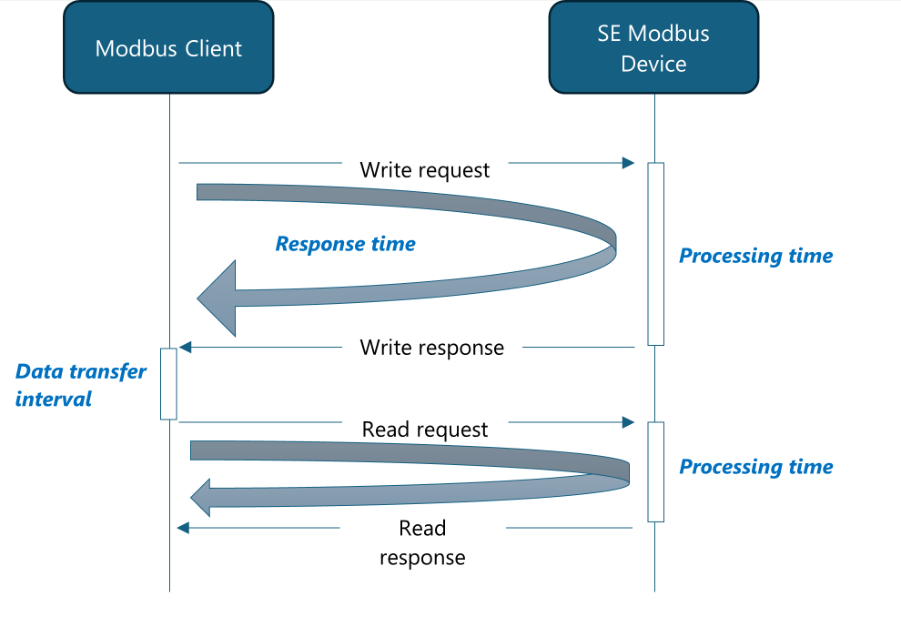

### Modbus External Interface

#### Indirect (Daisy-Chain)

You can connect the follower devices to leader using RS485 interface. You can connect the leader to the controller using RS485 or ethernet.

#### Direct/Single Inverter Connection

You can connect all inverters to the controller through individual Modbus TCP connection. This provides better timing performance.

### SolarEdge timing performance

| Type of command | Timing definition | Detail | Time [s] |
| --- | --- | --- | --- |
| Read | Response time (includes processing time) | | < 0.5 s |
| Write | Response time (includes processing time) | | < 0.5 s |
| Write | Reaction time of setpoint (dynamic) | Active Power (P) | < 1 s |
| Write | Reaction time of setpoint (dynamic) | Reactive Power (P) | < 5 sa |
| Write | Commit | | < 1.5 sb |
| Read/Write | Data transfer interval | | < 0.1 s |

a To optimize the reaction time, set the Error! Reference source not found. You must follow this command with a commit.

b You need to follow static write commands with a commit. This can cause a longer response time.

## Support Contact Information

If you have technical problems concerning SolarEdge products, contact us:

[https://www.solaredge.com/service/support](https://www.solaredge.com/service/support)

- Before contacting us, make sure to have the following information at hand: Model and serial number of the product in question.

- The error indicated on the product SetApp mobile application LCD screen or on the monitoring platform or by the LEDs, if there is such an indication.

- System configuration information, including the type and number of modules connected and the number and length of strings.

- The communication method to the SolarEdge server, if the site is connected. The product's software version as it appears in the ID status screen.
